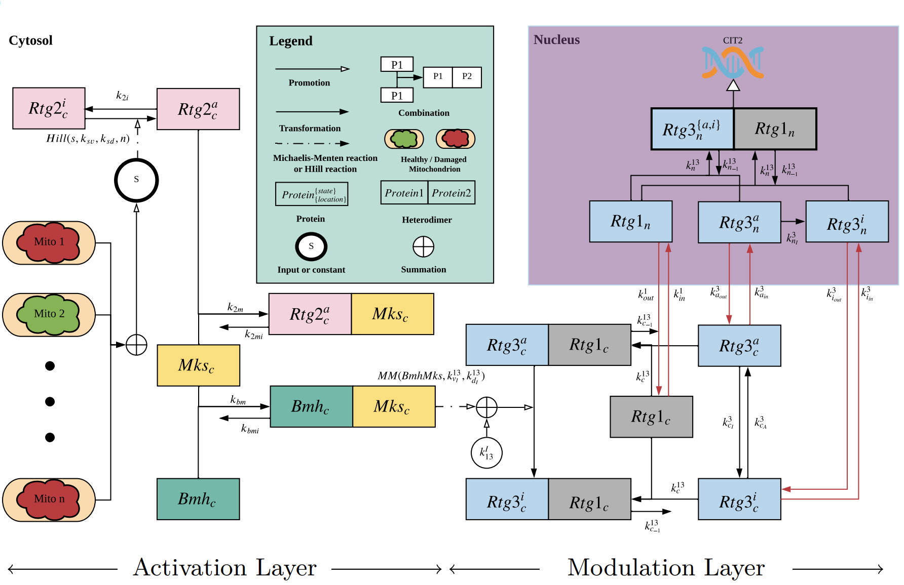

# RetroSignalModel.jl

[](https://stevengogogo.github.io/RetroSignalModel.jl/dev)
[](https://github.com/stevengogogo/RetroSignalModel.jl/actions)
[](https://codecov.io/gh/stevengogogo/RetroSignalModel.jl)





## Mitochondrial Retrograde Signalling


Mitochondrial retrograde signaling reports mitochondrial status to the nucleus. However, there is a lack of understanding of how the nucleus capture mitochondrial status in dynamics and information processing. It is a complicated biochemical reaction that occurs in most eukaryotic organisms. In this repository, we focus on the RTG pathway in yeast. This pathway is the simplest retrograde signaling pathway that has been investigated thoroughly. Data are collected from [1] and [2] (See [src/data/](src/data/)). This repository aims to compose known protein interactions and nucleus relocation that fulfills all known responses of the yeast RTG pathway. Monte-Carlo approach is used to solve this Boolean satisfiability problem, and the parameter searching/ simulation/ threading is facilitated by DifferentialEquations.jl [3]. 


## Installation

This repository is a Julia package. To use this function, one needs to install Julia first (https://julialang.org/)

Julia 1.6 or above
Use the following script to install this package in Julia REPL
    ```julia
    Using Pkg
    Pkg.activate(“.”) # create a new environment
   Pkg.add(url="https://github.com/stevengogogo/RetroSignalModel.jl#master")
    ```


## Implementation details

https://stevengogogo.github.io/RetroSignalModel.jl/dev/

## References

1. Sekito, Takayuki, Janet Thornton, and Ronald A. Butow. "Mitochondria-to-nuclear signaling is regulated by the subcellular localization of the transcription factors Rtg1p and Rtg3p." Molecular biology of the cell 11.6 (2000): 2103-2115.
2. Sekito, Takayuki, Zhengchang Liu, Janet Thornton, and Ronald A. Butow. “RTG-Dependent Mitochondria-to-Nucleus Signaling Is Regulated by MKS1 and Is Linked to Formation of Yeast Prion [URE3].” Molecular Biology of the Cell 13, no. 3 (March 2002): 795–804. https://doi.org/10.1091/mbc.01-09-0473.
3. Rackauckas, Christopher, and Qing Nie. “DifferentialEquations.Jl – A Performant and Feature-Rich Ecosystem for Solving Differential Equations in Julia.” Journal of Open Research Software 5, no. 1 (May 25, 2017): 15. https://doi.org/10.5334/jors.151.
