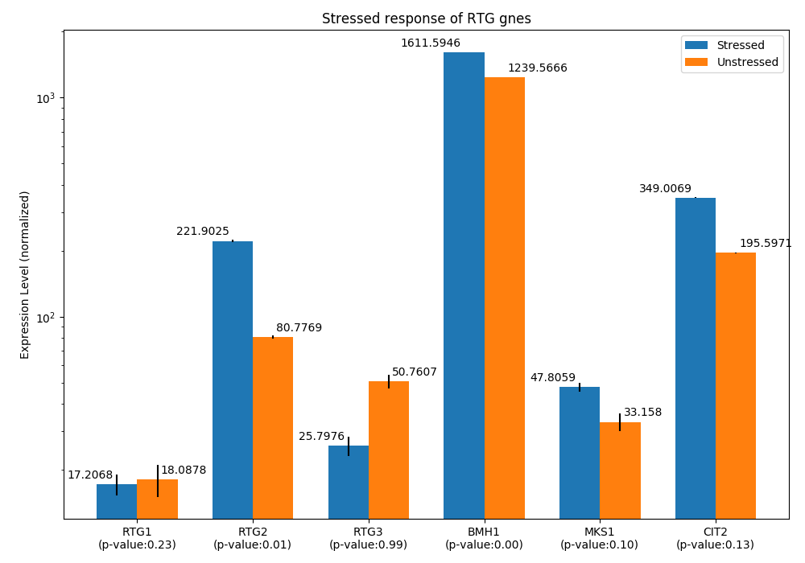

# RetroSignalModel.jl

[](https://stevengogogo.github.io/RetroSignalModel.jl/dev)
[](https://github.com/stevengogogo/RetroSignalModel.jl/actions)
[](https://codecov.io/gh/stevengogogo/RetroSignalModel.jl)


## Mitochondrial Retrograde Signalling


Mitochondrial retrograde signaling reports mitochondrial status to the nucleus. However, there is a lack of understanding of how the nucleus capture mitochondrial status in dynamics and information processing. It is a complicated biochemical reaction that occurs in most eukaryotic organisms. In this repository, we focus on the RTG pathway in yeast. This pathway is the simplest retrograde signaling pathway that has been investigated thoroughly. Data are collected from [1] and [2] (See [src/data/](src/data/)). This repository aims to compose known protein interactions and nucleus relocation that fulfills all known responses of the yeast RTG pathway. Monte-Carlo approach is used to solve this Boolean satisfiability problem, and the parameter searching/ simulation/ threading is facilitated by DifferentialEquations.jl [3]. 


## Installation


This repository is a Julia package. To use this function, one needs to install Julia first (https://julialang.org/)

Julia 1.6 or above
Use the following script to install this package in Julia REPL
    ```julia
    Using Pkg
    Pkg.activate(“.”) # create a new environment
   Pkg.add(url="https://github.com/stevengogogo/RetroSignalModel.jl#master")
    ```


## Implementation details

https://stevengogogo.github.io/RetroSignalModel.jl/dev/


--- 

# Dataset 

> See folder [src/data](src/data)

## Responses of Yeast RTG proteins to mitochondrial damage

> Data: [boolean_table_RTG13.csv](src/data/boolean_table_RTG13.csv)

This folder contains summarized responses of mitochondrial retrograde signaling in yeast.


### Components

|Standard Name|Variable Name|Details|
|---|---|---|
|RTG1|`rtg1`|https://www.yeastgenome.org/locus/S000005428|
|RTG2|`rtg2`|https://www.yeastgenome.org/locus/S000005428|
|RTG3|`rtg3`|https://www.yeastgenome.org/locus/S000000199|
|Mks1|`mks1`|https://www.yeastgenome.org/locus/S000005020|


### Definition of Response

In [1] and [2], RTG response is observed via GFP tags on either RTG1 or RTG3. In wild-type, mitochondrial damage can cause these proteins to accumulate in the nucleus, resulting in the intensified brightness of the nucleus region observed by fluorescent microscopy. As shown in [boolean_table_RTG13.csv](src/data/boolean_table_RTG13.csv), the responses are categorized in binary results: whether GFP is accumulated in the nucleus in a given condition. Based on [1] and [2], there are 20 reactions listed in the table. 

For example, the following is one of the conditions mentioned in [1]:

|rtg1|rtg2|rtg3|s|mks|gfp|Trans2Nuc|
|---|---|---|---|---|---|---|
|0|0|1|1|1|rtg3|1|

Under the columns of `rtg1`, `rtg2`, `rtg3` and `mks`, `0` means that the given protein is suppressed by knockout. On the other hand, `1` represent an expression of wild type. Also, `1` in `s` represent mitochondrial dysfunction, and `0` means the absence of mitochondrial damage. The `gfp` column describes the location of GFP tag. In this example, GFP tag is on `rtg3`. As known in [1], `Rtg3-GFP` translocates to the nucleus under this condition. Therefore, `Trans2Nuc` is marked as `1`, which means the GFP tags nucleus translocation happens.

### Reactions

There are 20 reactions summarized in the table. Some conditions are yet to be explored; some are from [1] (Sekito et al. 2000) or [2] (Sekito et al. 2002). Missing conditions are labeled with `NA`.

|Line Number|Reference|
|---|---|
|2|NA|
|3|[1]|
|4|[1]|
|5|[1]|
|6|[1]|
|7|[1]|
|8|[1]|
|9|[1]|
|10|NA|
|11|NA|
|12|[1]|
|13|[1]|
|14|[1]|
|15|[1]|
|16|[1]|
|17|[1]|
|18|[2]|
|19|[2]|
|20|[2]|
|21|[2]|


---

## Differential Gene Expression 

> Data: [RNAseq_RTG_expression.csv](src/data/RNAseq_RTG_expression.csv)
>
> Raw data and analysis: [RNAseq_RTG_expression](src/data/RNAseq_RTG_expression)


> *This figure is produced by [RNAseq_RTG_expression/analysis_RNA-Seq.ipynb](src/data/RNAseq_RTG_expression/analysis_RNA-Seq.ipynb)*

### Whole-genome RNA sequencing under normal and osmotic stress condition in yeast 

Whole-genome RNA sequencing was performed under normal conditions and osmotic stress [4] (GEO database's access number: GSE102475). This paper is selected because all RTG-related gene expressions are covered in this research, and this paper also provides stress condition that is informative to investigate the range of expressions of RTG elements. 

The original data is downloaded and stored at <a href="RNAseq_RTG_expression/data/Single Cell RNAseq_yeast_GSE102475.xlsx">Single Cell RNAseq_yeast_GSE102475.xlsx</a> [4].


### RTG differential gene expression


By using the differential gene expression [5], the relative expressions of Rtg1, Rtg2, Rtg3, Bmh1, Mks1 and Cit2 are analyzed by Discrete distributional differential expression [5] (D3E). Noted that Cit2 gene is used as an indicator of RTG response, while this procedure aims to get the relative expressions between RTG components rather than the exact RTG response. Zeros in RNA readouts from [4] were removed and filtered by genes of interest. The filtered data is summarized in the txt file called [`SingleCellRNAseq_yeast_GSE102475_LabelSep.txt`](src/data/RNAseq_RTG_expression/data/SingleCellRNAseq_yeast_GSE102475_LabelSep.txt). Further, differential gene expression analysis is done by D3E method by the following command


```terminal
python D3ECmd.py SingelCellRNAseq_yeast_GSE102475_LabelSep.txt  SingelCellRNAseq_yeast_GSE102475_LabelSep.out  Stressed Unstressed -m 1 -t 0 -z 0 -n 1 -v
```

the installation details can be found at https://github.com/hemberg-lab/D3E [5]. Alternatively, the filtered RNA seq data can be processed by D3E online service (https://www.sanger.ac.uk/sanger/GeneRegulation_D3E/).

The mean expression values (`mu1` in [analysis_RNA-Seq.ipynb](src/data/RNAseq_RTG_expression/analysis_RNA-Seq.ipynb)) are summarized in [RNAseq_RTG_expression.csv](src/data/RNAseq_RTG_expression.csv) that contains the relative expression levels of RTG components under normal and stressed conditions.


|File|Description|
|---|---|
|[RNAseq_RTG_expression.csv](src/data/RNAseq_RTG_expression.csv)|Differential gene expression of RTG elements|
|[analysis_RNA-Seq.ipynb](src/data/RNAseq_RTG_expression/analysis_RNA-Seq.ipynb)|Visualization of D3E processed differential gene expressions|
|[get_RTG-Expression-Table_zero-removed.ipynb](src/data/RNAseq_RTG_expression/get_RTG-Expression-Table_zero-removed.ipynb)|Remove zeros in RNA-seq data and select genes of interest|
|[SingleCellRNAseq_yeast_GSE102475_LabelSep.txt](src/data/RNAseq_RTG_expression/data/SingleCellRNAseq_yeast_GSE102475_LabelSep.txt)|RNA seq data of genes of interest (zeros are removed)|
|[d3e_SC_resp_RtgGenes_GSE102475.csv](src/data/RNAseq_RTG_expression/data/d3e_SC_resp_RtgGenes_GSE102475.csv)|Differential gene expression  (processed by https://www.sanger.ac.uk/sanger/GeneRegulation_D3E/)|


### Installation

The following steps are needed to execute Jupyter notebooks under [src/data/RNAseq_RTG_expression/](src/data/RNAseq_RTG_expression/). Noted that those notebooks are written in Python 3.7.

1. Install Python 3.7 or above (https://www.python.org/)
2. Install pip3 (https://pip.pypa.io/en/stable/)
3. Install Python packages
    ```
    pip3 install matplotlib
    pip3 install pandas
    pip3 install numpy
    pip3 install seaborn
    ```

## References

1. Sekito, Takayuki, Janet Thornton, and Ronald A. Butow. "Mitochondria-to-nuclear signaling is regulated by the subcellular localization of the transcription factors Rtg1p and Rtg3p." Molecular biology of the cell 11.6 (2000): 2103-2115. URL: https://doi.org/10.1091/mbc.11.6.2103
2. Sekito, Takayuki, Zhengchang Liu, Janet Thornton, and Ronald A. Butow. “RTG-Dependent Mitochondria-to-Nucleus Signaling Is Regulated by MKS1 and Is Linked to Formation of Yeast Prion [URE3].” Molecular Biology of the Cell 13, no. 3 (March 2002): 795–804. https://doi.org/10.1091/mbc.01-09-0473.
3. Rackauckas, Christopher, and Qing Nie. “DifferentialEquations.Jl – A Performant and Feature-Rich Ecosystem for Solving Differential Equations in Julia.” Journal of Open Research Software 5, no. 1 (May 25, 2017): 15. https://doi.org/10.5334/jors.151.
4. Gasch, Audrey P., et al. "Single-cell RNA sequencing reveals intrinsic and extrinsic regulatory heterogeneity in yeast responding to stress." PLoS biology 15.12 (2017): e2004050. URL: https://doi.org/10.1371/journal.pbio.2004050
5. Delmans, Mihails, and Martin Hemberg. "Discrete distributional differential expression (D3E)-a tool for gene expression analysis of single-cell RNA-seq data." BMC bioinformatics 17.1 (2016): 1-13. URL: https://doi.org/10.1186/s12859-016-0944-6